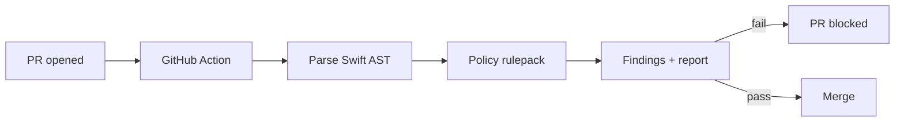

## Summary
Apple Policy Lint is a **deterministic Swift AST** scanner that turns Apple policy requirements into PR-time checks. It flags policy-sensitive API usage with exact file/line context and tells you what needs to be declared in `PrivacyInfo.xcprivacy`.

The gate stays rule-based and low-noise. In the Pro edition, **AI assist** helps with the human work: draft privacy manifest entries, propose “approved reason” candidates, and generate reviewer-ready PR explanations based on the exact findings.

---

## The problem
Teams usually discover Apple privacy/policy issues:
- **late** (right before submission),
- **inconsistently** (wiki checklists + tribal knowledge),
- and **expensively** (debugging after review feedback).

When this happens, you get:
- review churn,
- release delays,
- and “why didn’t we catch this earlier?” postmortems.

---

## What the Action does
- Parses Swift using an **AST** (tree-sitter), not regex
- Matches against a policy rulepack (**PoC today: hardcoded rules**)
- Posts a clean report in the PR
- Optionally fails the workflow to block merges

### Example finding (real output)
**Category:** Required Reason API: Active Keyboards  
**Symbol:** `activeInputModes`  
**Location:** `TestPipeline/TestPipeline/PolicyTrigger.swift:5:25`  
**Rule:** `APPLE_REQUIRED_REASON_ACTIVE_KEYBOARDS`

Remediation guidance:
> If this is real usage, ensure `PrivacyInfo.xcprivacy` declares `NSPrivacyAccessedAPITypes` with an approved reason for the relevant category.

---

## Why companies buy this
- **Shift-left compliance:** catch issues on PRs, not during App Store submission
- **Fewer release delays:** reduce review ping‑pong caused by missing declarations
- **Policy-as-code:** rules live in version control, not in people’s heads
- **Auditable output:** the PR report becomes evidence that someone reviewed the policy usage
- **Low-noise by design:** deterministic checks, clean formatting, no AI hallucinations in the gate

---

## How it works

## Status and roadmap

Today:
- PoC hardcoded rulepack
- High-signal PR report formatting (the part that matters)

Next:
- JSON rulepacks (policy packs become content/config, not code changes)
- Allowlists + justifications (org-approved exceptions without weakening the gate)
- Expand beyond Swift into Objective‑C (where needed)
- SDK scanning and transitive dependency reporting (what your app pulls in)

## Free (OSS wedge)

Best for open-source + early adoption.
- Swift AST scanner
- Starter policy pack (baseline Apple policy-sensitive APIs)
- PR comment report
- Community updates

## Pro (teams)
Best for private repos and teams that can’t afford compliance surprises.
- Private repos
- Maintained + updated Apple policy packs
- Org-level allowlists + reviewable approved justifications
- **AI-assisted** `PrivacyInfo.xcprivacy` drafting + PR-ready reviewer notes (advisory only)
- Audit export (for release reviews)

## Enterprise
- SSO + policy dashboard
- Multi-repo fleet reporting
- Custom policy packs for internal SDKs and regulated workflows

## What the PR report looks like
