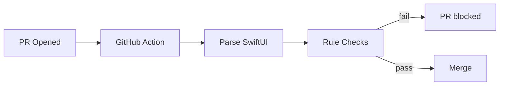

## Summary
This action fails PRs when SwiftUI accessibility practices are violated. It’s a practical “cheese → mousetrap” wedge: free linting that leads to better UI quality and deeper tooling.

```mermaid
flowchart LR
  A[PR Opened] --> B[GitHub Action]
  B --> C[Parse SwiftUI]
  C --> D[Rule Checks]
  D -->|fail| E[PR blocked]
  D -->|pass| F[Merge]
```