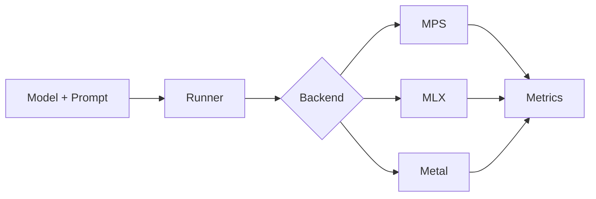

## Summary
This work benchmarks LLM inference on Apple Silicon across MPS, MLX, and Metal-centric pipelines with repeatable measurements.

## Results (placeholder)
  - Latency: TBD
  - Tokens/sec: TBD
  - Peak memory: TBD
