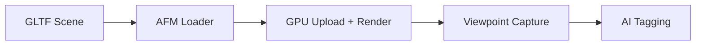

## Summary
This work focuses on pushing Apple’s rendering stack to handle multi-million-triangle GLTF scenes interactively, then layering a viewpoint tagging workflow.

## Notes

- Add benchmarks (load time, FPS, memory).
- State constraints (device, OS version, triangle count).
- List what you learned or what you’d do next.